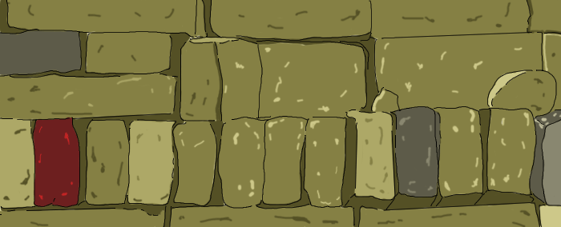

A Pile of Bricks
================

Challenge Description:
----------------------

You have a pile of bricks. Every brick has it's index number and coordinates of opposite vertices.
You know that somewhere on the wall there is a rectangular hole, and you are given coordinates of opposite vertices of 
that hole.

Determine which bricks may pass through that hole.

In situations where brick and hole have an equal sizes, we assume that it can pass through this hole.
All the holes are two-dimensional. All of the bricks are three-dimensional. 

Input sample:
-------------

Your program should accept as its first argument a path to a filename. The input file contains several lines. Each line 
is one test case.

Each line contains coordinates of opposite vertices of a hole (before the vertical bar) separated by space bar and the 
list of bricks you need to check. Each brick is enclosed in parentheses where the 1st number is a brick's index number, the 2nd and 3rd group of numbers are brick's coordinates of opposite vertices (separated by a space bar), each brick is divided by semicolon. E.g. 

    [4,3] [3,-3]|(1 [10,9,4] [9,4,2])
    [-1,-5] [5,-2]|(1 [4,7,8] [2,9,0]);(2 [0,7,1] [5,9,8])
    [-4,-5] [-5,-3]|(1 [4,8,6] [0,9,2]);(2 [8,-1,3] [0,5,4])

    
Output sample:
--------------

For each set of bricks produce a list of bricks (their index numbers in ascending order separated by comma) that can 
pass through the hole. E.g. 

    1
    1,2
    -
    
Constraints:
------------

* Coordinates are in range [-100, 100]
* There might be up to 15 bricks you need to check. 