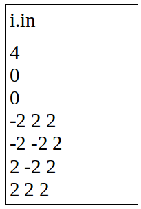
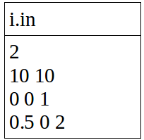
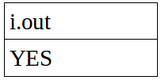
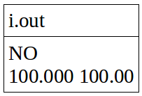

Deep forest
===========

Challenge Description:
----------------------

We say that the observer is in the deep forest, if from his current position
the observer sees only the trees. Map of the forest is given and coordinates of the point, at which the observer is. It is required to determine whether the forest is deep for this observer.
All the trees of the forest are represented as circles on the map. Some  trees are grown together in the forest (images of trees intersect on the map), and one tree can be
inside the other. The point at which there is an observer does not lie within or on the boundary of one of the trees.

Input sample:
-------------

Input file contains integer N - the number of trees (1 ≤ N ≤ 50 000) at the first line. 
Then there are two numbers that specify the location of the observer at the second and the third line. 
The N triples specifying trees. The first two numbers specify the coordinates of the center, and the third - the radius.
 All coordinates are accurately expressed and are real numbers with no more than two characters after the decimal point, modulo not exceeding 100,000.

Input file sample 1

Input file sample 2

Output sample:
--------------

The first line of output file should contain a message YES, if the forest is deep and NO - if not. 
In the second case, the second line of the output file should contain the coordinates of the point, looking in the 
direction of which the observer does not see the trees (ie the beam along which the observer looks, does not go 
into the tree and does not intersect any of the trees). Coordinates need to bring at least 3 characters after the 
decimal point. Modules of output number shall not exceed 300,000.

Output file sample 1

Output file sample 2

Constraints:
------------
* All coordinates in input file are accurately expressed and are real numbers with no more than two characters after the decimal point, modulo not exceeding 100,000.
* N - the number of trees (1 ≤ N ≤ 50 000).
* Coordinates need to bring at least 3 characters after the decimal point in the output file.
* Modules of output number shall not exceed 300,000.
