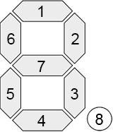
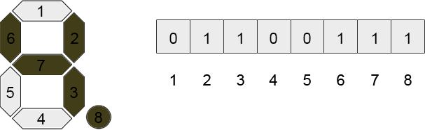

Broken LCD
==========

Challenge Description:
----------------------

You have a 12-digit LCD, each digit consists of 8 segments: 7 segments to display numbers and one segment to display 
a decimal mark: 

The number in each digit is displayed by turning segments on or off. It can be represented as a binary 8-bit number, 
each bit of which is a segment, ordered in the following binary representation: 

 

For example, number ‘4.’ (with the decimal mark turned on) corresponds to the following binary representation: 

Some segments of the display are damaged and are always turned off. Your task is to determine whether a given number 
can be displayed on the damaged LCD. You can start displaying the number with the arbitrary digit of the LCD. 

Input sample:
------------

The first argument is a filename. Each line of the file contains binary 8-bit numbers, which represents the state of 
the segments, starting from the most left digit, and the number that you must show on the display. The binary 
numbers are separated by spaces, the number to display is separated by a semicolon.

For example: 

    10110001 11111000 11111110 11111111 11111111 11111111 11111111 11101101 11111111 01111111 11110010 10100111;84.525784
    11111111 11110110 11101111 11110111 10111110 11110110 10111011 10100111 11111100 01100100 11111101 01011110;5.57
    11000010 00001111 11111111 10111111 11101011 11110011 01111110 11011111 11111111 11111111 11111001 01101110;857.71284
    11111111 01110111 10111011 11001101 11111011 11101010 11110100 01001101 11011111 11111010 10010110 10111111;66.92
    11111011 10010001 11111011 11111101 10011111 10111110 01111100 11011101 10111001 11111110 11101111 11110110;188.87

Every binary number represents the state of the segments in one digit. 1 means that a segment is working and can 
be turned on or off, 0 means that a segment is damaged and is always turned off. 
    
Output sample:
------------

Print to stdout 1 for each test case if the number can be displayed on a given LCD, or 0 – if the number 
cannot be displayed. Print out one number in a line. 

For example: 

    1
    1
    1
    0
    0
    
Constraints:
------------

1. The number of test cases is 100.
2. The damaged segments are always turned off.
3. The number can be displayed starting from any digit.
4. Every number has a decimal mark (if it is an integer, a decimal mark is placed after the last digit).
