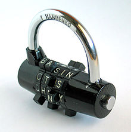

Code combinations
=================

Challenge Description:
----------------------

You definitely know the game where you have to make as many words from the given letters as possible. In our 
case, the rules are a bit different: you need to check whether it is possible to make the word 'code' with the 
four given letters, and, if possible, count how many times you can do this. Letters can be in a various order.

Solution example:

    | * * * * |
    | * c o * |     | c o |  =  1
    | * d e * |     | d e |

Input sample:
-------------

The first argument is a path to a file. Each line includes a test case with symbol matrix. Each line of the matrix 
is separated by a pipeline '|'. 

    **** | *co* | *de* | ****
    codx | decx
    co | dx

    
Output sample:
--------------

You need to calculate and print a number that will tell how many times you can make the word ‘code’ from the letters 
in the matrix, using a 2x2 submatrix. 

    1
    2
    0

Constraints:
------------

The number of rows or columns in the matrix can be from 2 to 10.

Matrix can include one face for 2 solutions in case.

    | c o d x |     | c o |     | o d |  =  2    
    | d e c x |     | d e |     | e c |

The number of test cases is 40.