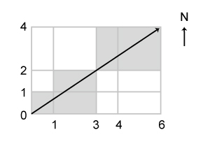
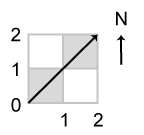

City Blocks Flyover
===================

Challenge Description:
----------------------

In our city we need to know how many blocks were impacted by a helicopter flying over our city. In our city, all of 
the blocks are rectangular. They are separated by N number of straight horizontal avenues that run East-West and M 
number of straight vertical streets which run North-South.

A helicopter took off at the South-West corner of the city and flew directly to the farthest North-East corner. 
Your challenge is to determine how many city blocks it flew over?
You will be given two lists, the first one is for streets and the second one is for avenues. Each avenue 
and each street is represented by a distance D to itself from the helicopter's starting point. E.g. 

 

On the first diagram the streets and the avenues are represented by the following lists: 

    (0,1,3,4,6) for streets
    (0,1,2,4) for avenues

Input sample:
------------

Your program should accept as its first argument a path to a filename. Each line in this file is one test case. 
Each test case will contain a list of distances for streets and a list of distances for avenues. Each 
list is in a brackets and the distances are separated by comma. The lists themselves are separated by a single whitespace. E.g. 

    (0,2,4,8,10,13,14,18,22,23,24,33,40,42,44,47,49,53,55,63,66,81,87,91) (0,147,220)
    (0,1,2,4) (0,1,3,4,5)
    (0,1,3,4,6) (0,1,2,4)

    
Output sample:
------------

For each set of input print out the number of blocks the helicopter has flown over. E.g. 

    24
    6
    5
    
Constraints:
------------

* N, M are in range [1, 100]
* D is in range [1, 1000]     