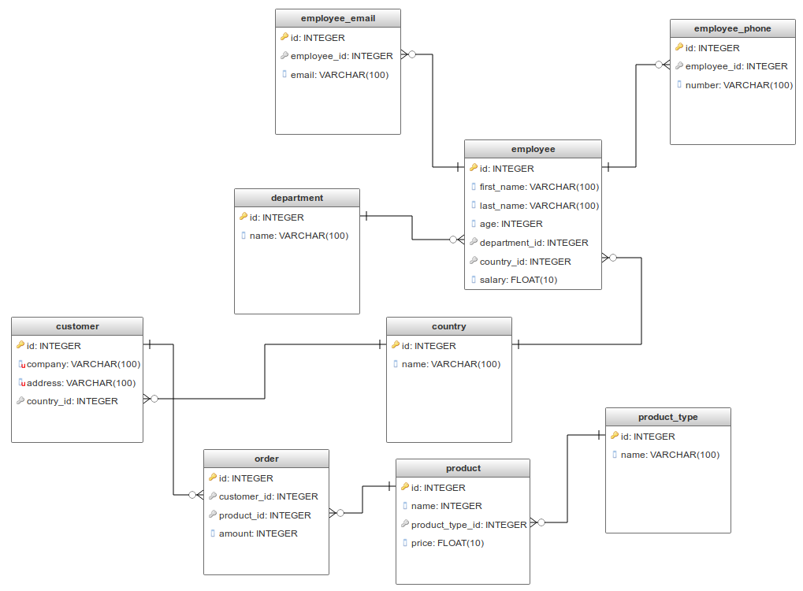

JDBC Connector
===============

Challenge Description:
----------------------

1. Create program to connect to MySQL database and query all values from a tables.
2. Create Java bean for each table
3. Create connection pool
4. Create classes for CRUD operations on each table
5. Create JUnit tests with runtime database with JDBC connection
6. Create sample data for tables in CSV format and upload to runtime DB via JDBC
7. Use env variables to configure JDBC parameters (user, password, driver etc.)

