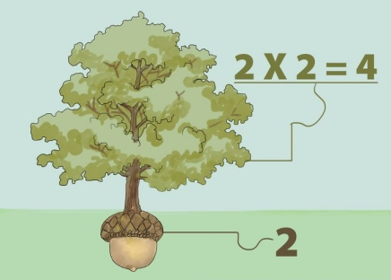

Find a Square
=============

Challenge Description:
----------------------

You have coordinates of four points on a plane. Check whether they make a square. 

Input sample:
------------

Your program should accept as its first argument a path to a filename. Input example is the following 

    (1,6), (6,7), (2,7), (9,1)
    (4,1), (3,4), (0,5), (1,2)
    (4,6), (5,5), (5,6), (4,5)

All numbers in input are integers between 0 and 10   
    
Output sample:
------------

Print results in the following way. 

    false
    false
    true