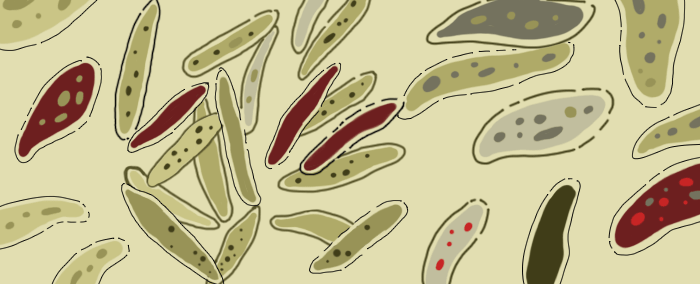

Game of Life
============

Challenge Description:
----------------------

The challenge is based on John’s Conway ‘Game of Life’. The Game of 
Life is a cellular automaton developed by the British mathematician 
John Conway in 1970. The universe of the game is an infinite 
two-dimensional orthogonal grid of square cells, each of which is in 
one of two possible states, alive or dead. Every cell that is 
horizontally, vertically, or diagonally adjacent interacts with its 
eight neighbors. At each step in time, the following iterations occur: 

* Any live cell with fewer than two live neighbors dies, as if caused by under-population.
* Any live cell with two or three live neighbors lives on to the next generation.
* Any live cell with more than three live neighbors dies, as if by overcrowding.
* Any dead cell with exactly three live neighbors becomes a live cell, as if by reproduction.

The initial pattern constitutes the seed of the system. The first 
generation is created by applying the above rules simultaneously to 
every cell in the seed — births and deaths occur simultaneously. 
The rules continue to be applied repeatedly to create
 further generations.

You have a grid of size N×N, seeded with some live cells. Your task is to determine the state of the grid after 10 iterations. 

Input sample:
------------

 The first argument is a file with the initial state of the grid. Alive cells are shown as asterisks ‘*’, and dead cells are shown as points ‘.’. E.g.

    .........*
    .*.*...*..
    ..........
    ..*.*....*
    .*..*...*.
    .........*
    ..........
    .....*..*.
    .*....*...
    .....**...
    
Output sample:
------------

Print to stdout the state of the grid after 10 iterations. E.g.

    ..........
    ...*......
    ..*.*.....
    ..*.*.....
    ...*......
    ..........
    ..........
    ..........
    ..........
    ..........

Constraints:
------------

1. The size of the grid in real input is 100×100 cells.
2. The cells outside the grid borders are assumed to be dead.
