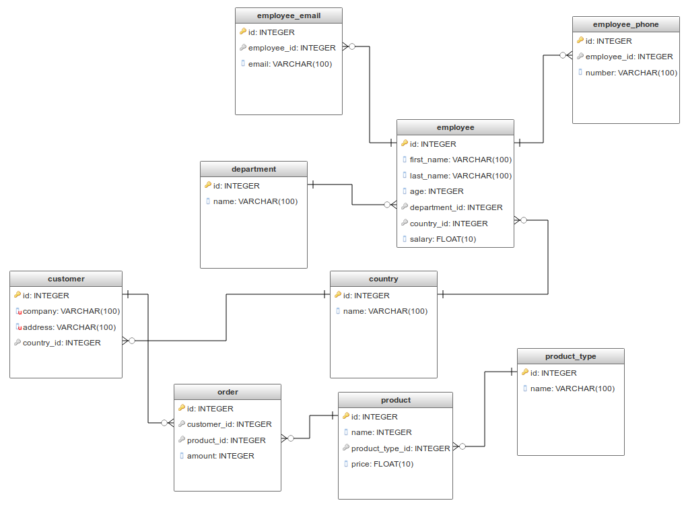

JDBC Connector
===============

Challenge Description:
----------------------

1. Create program to connect to MySQL database and query all values from a tables.
2. Create Java bean for each table
3. Create connection pool
4. Create classes for CRUD operations on each table
5. Create JUnit tests with runtime database with JDBC connection
6. Create sample data for tables in CSV format and upload to runtime DB via JDBC
7. Use env variables to configure JDBC parameters (user, password, driver etc.)
8. Add two profiles in maven for running JUnit tests with two DBs: H2 and MySQL.
9. Add bash scripts to configure env variables of JDBC connection
10. Configure main class for jar file
11. Add logging into file and console

Prerequisites
-------------

    mysql-server, git, java, maven
    OS: CentOS, Ubuntu

Quick start
------------

    git clone https://github.com/oleksiy-sayankin/code-challenges.git
    cd code-challenges/javaee/moderate/jdbc-connector
    mvn clean package -DskipTests
    . bin/jdbc-connector.sh

Run JUnit tests with H2 JDBC diver
-----------------------------------------

1. Configure JDBC connection params in main pom.xml

2. Run in command line
 

    cd $JDBC_CONNECTOR_HOME
    mvn clean install -Ptest-h2 

Run JUnit tests with MySQL JDBC diver
-----------------------------------------

1. Configure JDBC connection params in main pom.xml

2. Run in command line
 

    cd $JDBC_CONNECTOR_HOME
    mvn clean install -Ptest-mysql 

Folders structure
-----------------

    JDBC_CONNECTOR_HOME
        |
        + bin          # shell scripts to configure JDBC and run jar file  
        |
        + conf         # Log4j2 configuration here
        |
        + data         # data for tables
        |
        + logs         # output logs here
        |
        + src          # source folder
        |
        + target       # jar files