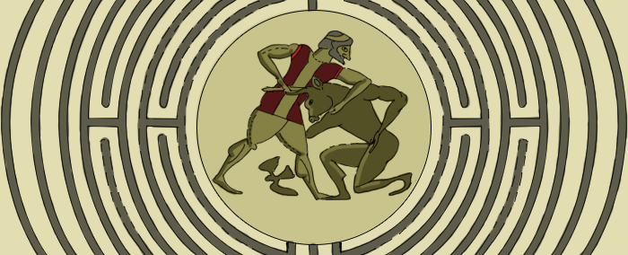
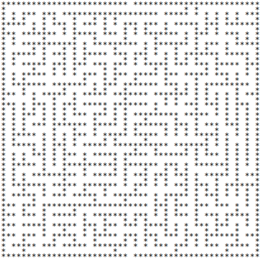
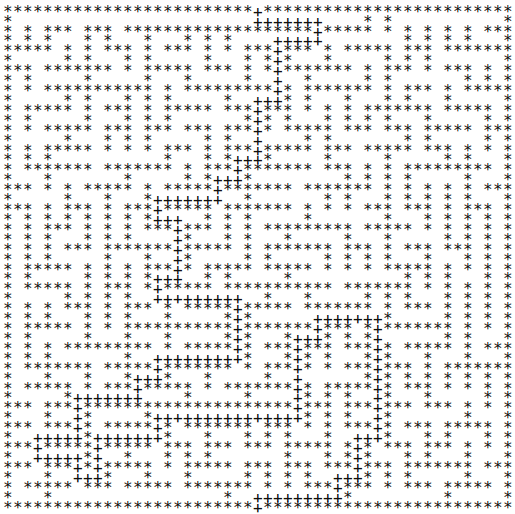

The Labyrinth
=============

Challenge Description:
----------------------

You are given a text with a pseudographical schema of a labyrinth. Walls are marked with asterisk symbols (*). Your job is to write a program that finds the shortest way from the upper entrance to the lower exit and prints out the labyrinth schema containing a path marked with plus symbols (+).
Input sample:

A text file with labyrinth schema.

Output sample:

Print to stdout the labyrinth schema containing the shortest way out marked with ‘+’ symbols:

Constraints:
------------

The size of a labyrinth is up to 101×101 cells. There can be more than one way to pass the labyrinth, but the shortest way is always unambiguous and never has branches. 