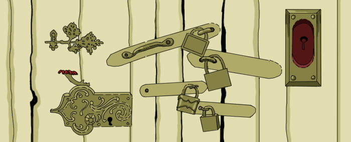

Locks
=====

Challenge Description:
----------------------

 There are N unlocked rooms located in a row along the corridor.

A security guard, who starts the beat at the beginning of the corridor, 
passes by and closes the lock of every second door (2nd, 4th, 6th…). 
Then he returns to the beginning of the corridor, and passes by again 
changing the state of every third door (3rd, 6th, 9th…) to the opposite 
state — if the door is closed, security guard opens it; if the door is 
open, he closes it.

One iteration consists of two beats (when the security guard closes each 
second door, and changes the state of each third door to the opposite 
state). The iteration repeats M-1 times.

During the last iteration, the security guard just changes the state 
of the last door in a row (closes it, if the door is open or opens it, 
if the door is closed).

Your task is to determine how many doors have been left unlocked. 

Input sample:
------------

 Your program accepts a filename as its first argument.

Each line of input contains 2 integers separated by space. The first 
integer represents number of doors (N), the second — number of iterations (M). 

    3 1
    100 100

    
Output sample:
------------

For each line of input print out how many doors are left unlocked:

    2
    50