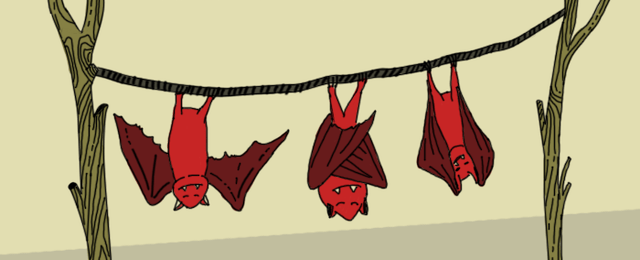

Bats Challenge
==============

Challenge Description:
----------------------

 There is a wire between two buildings outside of your window. Bats love to hang there, but they never hang closer 
 than "d" centimeters from each other. They also don't hang closer than 6 centimeters from any of the buildings.

Your task is to determine the maximum number of additional bats that can fit on the wire assuming they 
have a zero width. 

Input sample:
------------

Your program should accept a file as its first argument. Each line of input contains three space separated integers: 
the length of the wire "l", distance "d", and number of bats "n" that are already hanging on the wire.

The "n" number of bats is located in any order. All numbers are integers. You can assume that the bats that are 
already hanging on the wire are at least 6 cm from the buildings and at least "d" centimeters apart from each other.

For example: 

    22 2 2 9 11
    33 5 0
    16 3 2 6 10
    835 125 1 113
    47 5 0
    
Output sample:
------------

For each line of input, print out one integer to determine the maximum number of additional bats that can possibly 
hang on the wire.

For example: 

    3
    5
    0
    5
    8