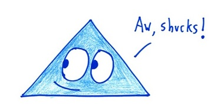
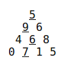

Pass Triangle
=============

Challenge Description:
----------------------

By starting at the top of the triangle and moving to **adjacent** numbers on the row below, the maximum total 
from top to bottom is **27**. 

5 + 9 + 6 + 7 = 27 

Input sample:
------------

Your program should accept as its first argument a path to a filename. Input example is the following: 

    5
    9 6
    4 6 8
    0 7 1 5
    
Output sample:
------------

The correct output is the maximum sum for the triangle. So for the given example the correct answer would be

    27