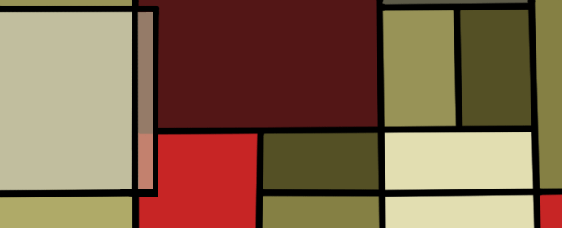

Overlapping Rectangles
======================

Challenge Description:
----------------------

Given two axis aligned rectangles A and B, determine if the two overlap. The rectangles considered overlapping if 
they have at least one common point. 

Input sample:
-------------

Your program should accept as its first argument a path to a filename. Each line in this file contains 8 comma 
separated co-ordinates. The co-ordinates are upper left x of A, upper left y of A, lower right x of A, lower 
right y of A, upper left x of B, upper left y of B, lower right x of B, lower right y of B. E.g. 

    -3,3,-1,1,1,-1,3,-3
    -3,3,-1,1,-2,4,2,2

    
Output sample:
--------------

Print out True or False if A and B intersect. E.g. 

    False
    True