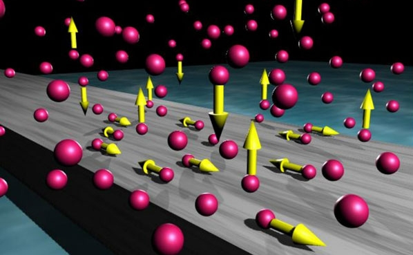

Particles
=========

Challenge Description:
----------------------

Create a window application that simulates the movement of particles in the plane in a closed rectangular area. 
Each particle has an initial position in the center of the rectangle and the initial velocity - the vector with a 
random direction and the random module. The distribution of random variables is normal. If the particle touches the
 edge of the area, it is reflected by the laws of physics (the angle of reflection equals the pitch angle and the 
 module of the velocity remains the same).
 
 
Constraints:
------------

* The number of particles N = 1,000;
* If you change the window size the size of the rectangular area with particlea also varies; no particles
disappear and are not added.
* Resizing the area with particles occurs simultaneously with the movement of the mouse on the screen while dragging the window borders. Particles  continue to move during the change of the boundaries of the region.
* The application contains the following buttons:  
 o [Start] - start motion of the particles;  
 o [Stop] - stop motion;  
 o [Exit] - exit from the program;  
* If you press the button [Start], (after the [Stop]) particles begin a new movement in the center of the rectangular area.