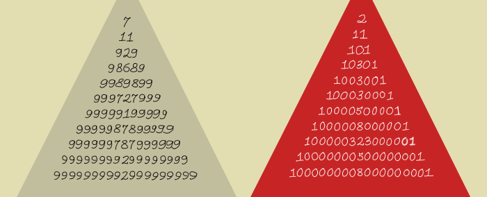

Prime Palindrome
================

Challenge Description
---------------------

Write a program which determines the largest prime palindrome less than 1000. 

Input sample
------------

There is no input for this program.

Output sample
-------------

Print to stdout the largest prime palindrome less than 1000.

929
